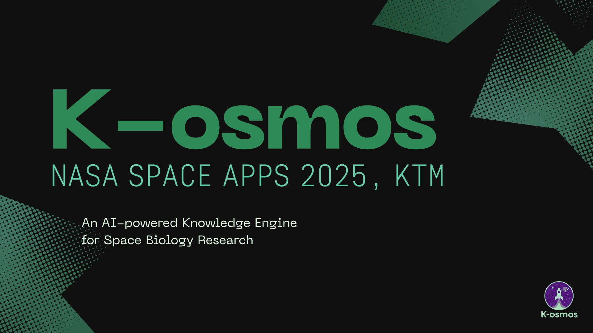
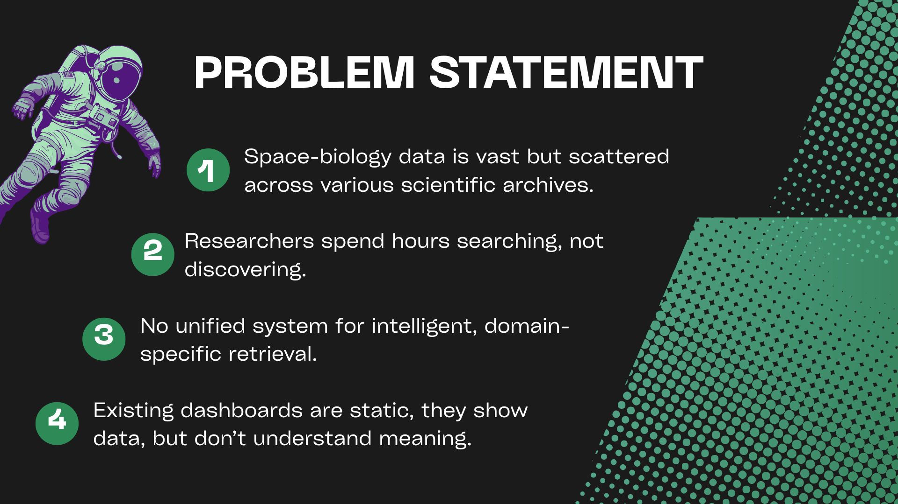
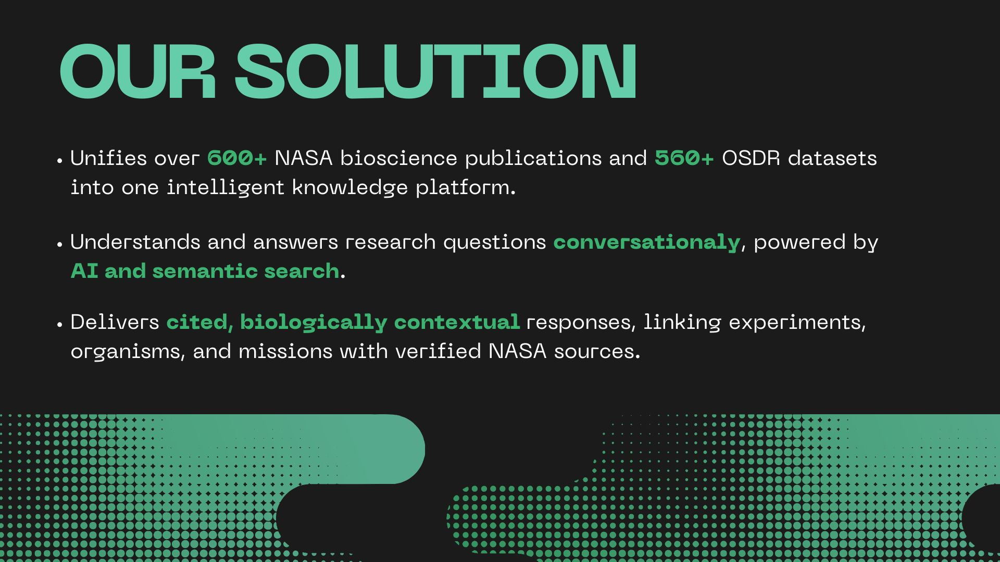
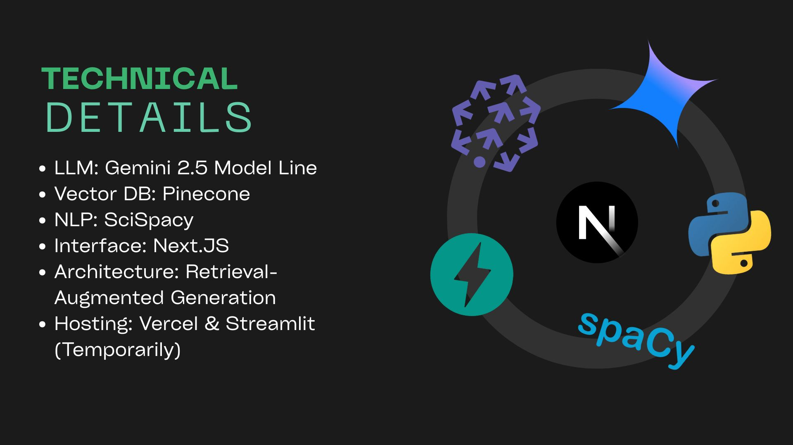
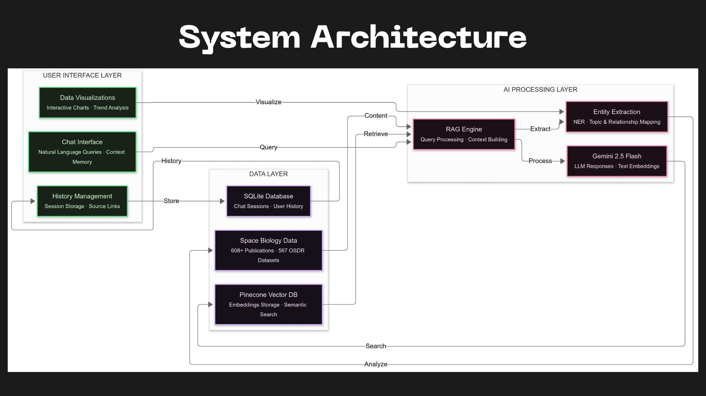
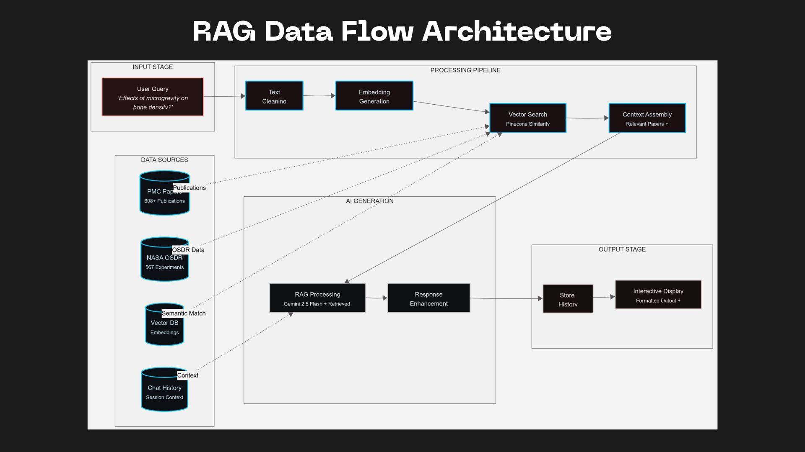
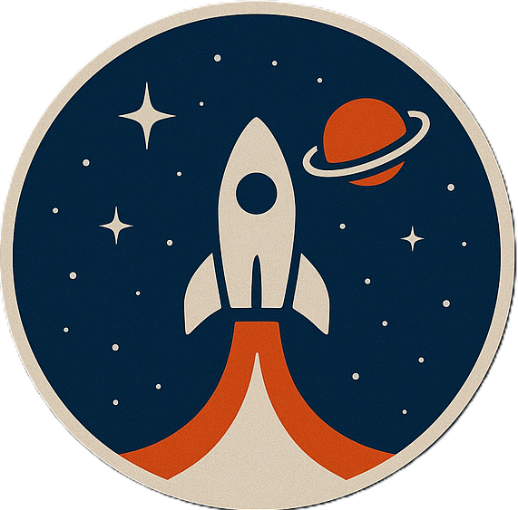

# Space Biology Knowledge Engine

<div align="center">

**AI-Powered Research Platform for Space Biology Literature**

*Advancing space biology research through intelligent artificial intelligence*

[](https://www.spaceappschallenge.org/)
[](LICENSE)
[](https://github.com/yourusername/k-osmos)

</div>

---

## 🌟 Overview

K-OSMOS (Knowledge-Optimized Space Medicine and Omics System) is an advanced AI-powered research platform that revolutionizes how scientists access, analyze, and discover insights from space biology literature. Built for NASA Space Apps Challenge 2025, combining cutting-edge NLP with comprehensive space research databases.

**Mission**: Democratize access to space biology knowledge and accelerate scientific discovery through intelligent, comprehensive research tools.









## Key Features

- **Intelligent Chat Interface** - Natural language queries with contextual AI responses
- **Advanced Analytics Dashboard** - Research trends and entity relationship mapping  
- **Comprehensive Search** - Semantic search across 608+ papers and 567 NASA datasets
- **Extensive Knowledge Base** - Curated space biology literature and OSDR datasets
- **Modern UX** - Responsive design with dark/light mode support


## 🚀 Quick Start

### Prerequisites
- **Python 3.8+** and **Node.js 18+**
- **Git** for cloning

### Installation & Setup

1. **Clone and Setup**
   ```bash
   git clone https://github.com/yourusername/k-osmos.git
   cd k-osmos
   ```

2. **Run Setup Script**
   ```bash
   # Linux/macOS
   ./scripts/setup.sh
   
   # Windows
   scripts\setup.bat
   ```

3. **Configure API Keys**
   Edit `.env` file:
   ```env
   GEMINI_API_KEY=your_gemini_api_key_here
   PINECONE_API_KEY=your_pinecone_api_key_here
   PINECONE_ENVIRONMENT=your_pinecone_environment
   ```

4. **Start Application**
   ```bash
   # Linux/macOS
   ./scripts/start_all.sh
   
   # Windows
   scripts\start_all.bat
   ```

5. **Access Platform**
   - **Frontend**: http://localhost:3000
   - **Backend API**: http://localhost:8000
   - **API Docs**: http://localhost:8000/docs

## 🤝 Contributing

We welcome contributions! Fork the repo, create a feature branch, and submit a pull request.

**Ways to contribute:**
- Research papers and dataset curation
- Feature development and bug fixes  
- Documentation improvements
- Community feedback and testing

## 🙏 Acknowledgments

**NASA Space Biology Program** - Comprehensive datasets and Space Apps Challenge support  
**PubMed Central** - Open access to peer-reviewed literature  
**ISS Research Community** - Generating the scientific data that powers our insights


<div align="center">



### Built by Team K-OSMOS for NASA Space Apps 2025

**Advancing space biology research through intelligent AI**

*✨ One discovery at a time ✨*

</div>
