<div align="center">
  
  
  ## Space Biology Knowledge Engine
  
  [](https://python.org)
  [](https://streamlit.io)
  [](https://www.spaceappschallenge.org)
  [](LICENSE)
  
  **AI-Powered Research Platform for Space Biology Literature**
  
  *Transforming space biology research through intelligent semantic search and conversational AI*
  
  **[🚀 Try K-OSMOS Live](https://k-osmos.streamlit.app/)**

</div>

---

## About K-OSMOS

**Knowledge-Oriented Space Medicine Operations System (K-OSMOS)** is an advanced AI-powered research platform designed specifically for the space biology research community. Built for NASA Space Apps Challenge 2025, K-OSMOS combines state-of-the-art artificial intelligence with comprehensive space biology datasets to accelerate scientific discovery.

### Core Value Proposition

K-OSMOS addresses the critical challenge of knowledge discovery in space biology research by providing researchers with an intelligent interface to explore, analyze, and synthesize information from over 1,175 space biology resources (608+ peer-reviewed publications + 567 NASA OSDR experimental datasets) through advanced RAG (Retrieval-Augmented Generation) technology.

### Key Capabilities

**Intelligent Search & Discovery**
- Natural language query processing with contextual understanding
- Semantic similarity search across 1,175+ space biology resources (608+ PMC publications + 567 OSDR datasets)
- Multi-modal filtering by mission, organism, tissue type, and research focus
- Real-time source citation and evidence tracking

**Conversational AI Interface**
- ChatGPT-style conversational experience with persistent memory
- Context-aware follow-up questions and recommendations
- Automated entity extraction (organisms, missions, genes, proteins)
- Interactive research guidance and hypothesis generation

**Advanced Analytics & Visualization**
- Research trend analysis across 20+ years of space biology studies
- Mission-specific outcome comparisons (ISS, Space Shuttle, Apollo)
- Interactive charts and graphs powered by Plotly
- Knowledge graph visualization of research relationships

**Production-Ready Architecture**
- Scalable vector database with Pinecone integration
- Asynchronous processing for optimal performance
- Comprehensive error handling and system monitoring
- Enterprise-grade security and API key management

---

## Technology Stack

### Core Infrastructure
- **Application Framework**: Streamlit 1.32+ for interactive web interface
- **Backend Processing**: Python 3.9+ with AsyncIO for concurrent operations
- **AI/ML Platform**: Google Gemini 2.5 Flash for natural language processing
- **Vector Database**: Pinecone for semantic search and similarity matching
- **Data Processing**: Pandas, NumPy for data manipulation and analysis

### AI & Machine Learning
- **Language Model**: Google Gemini 2.5 Flash (15 req/min, 1M tokens/day free tier)
- **Embeddings**: Google Text Embedding 004 for semantic vector generation
- **NLP Processing**: SciSpacy for scientific entity recognition
- **RAG Architecture**: LangChain framework for retrieval-augmented generation

### Data Sources & Integration
- **Primary Dataset**: 608+ peer-reviewed publications from PMC space biology corpus
- **NASA OSDR Integration**: 567 experimental datasets from NASA's Open Science Data Repository
- **Web Scraping**: Automated extraction of research paper links and metadata
- **CSV Data Processing**: Custom ingestion pipeline for structured research datasets
- **RAG Implementation**: Advanced retrieval-augmented generation for contextual responses
- **Real-time Processing**: Automated data enrichment and knowledge graph updates

---

## Installation

**🚀 Live Demo:** https://k-osmos.streamlit.app/

### System Requirements

| Component | Minimum | Recommended | Platform Support |
|--------------|------------|----------------|---------------------|
| **Python** | `3.9` | `3.12` | Latest stable version |

---

### Quick Start Guide

```bash
# Clone the repository
git clone https://github.com/K-OSMOS/space-biology-knowledge-engine.git
cd space-biology-knowledge-engine

# Create and activate virtual environment
python -m venv kosmos-env

# Activate environment
# Windows
kosmos-env\Scripts\activate

# macOS/Linux
source kosmos-env/bin/activate

# Install dependencies
pip install -r requirements.txt

# Install NLP dependencies for enhanced entity extraction
pip install spacy scispacy
python -m spacy download en_core_web_sm

# Configure environment variables
cp .env.example .env
# Edit .env file with your API keys (see API Configuration section)

# Verify API connections
python test_apis.py

# Initialize system databases
python main.py init

# Load sample datasets
python main.py ingest --csv-file data/raw/SB_publication_PMC.csv
python scripts/ingest_data.py  # Includes both publications and OSDR datasets

# Launch the application
streamlit run kosmos_app.py
```

<div align="center">

**🎉 Success! K-OSMOS should now be running at** `http://localhost:8501`

</div>

### Docker Deployment (Optional)

<div align="center">

**Containerized deployment for production environments**

</div>

```bash
# Build Docker image
docker build -t kosmos-space-biology .

# Run container with environment file
docker run -p 8501:8501 --env-file .env kosmos-space-biology

# Alternative: Run with inline environment variables
docker run -p 8501:8501 \
  -e GEMINI_API_KEY=your_key \
  -e PINECONE_API_KEY=your_key \
  -e PINECONE_INDEX_NAME=your_index \
  kosmos-space-biology
```


---

## Data Ingestion into RAG System

### Loading Data Sources into K-OSMOS

K-OSMOS requires data to be ingested into the vector database to provide intelligent responses. Here are the methods to populate your RAG system:

#### Method 1: Automated Complete Ingestion (Recommended)

```bash
# Run the complete data ingestion pipeline
# This will ingest both publications and OSDR datasets
python scripts/ingest_data.py

# Skip TaskBook ingestion if not needed (faster)
python scripts/ingest_data.py --skip-taskbook

# Custom batch size for slower systems
python scripts/ingest_data.py --batch-size 25
```

#### Method 2: Individual Data Source Ingestion

**Ingest CSV Publications:**
```bash
# Load your own research papers from CSV
python -c "
import asyncio
from data_ingestion.csv_ingester import CSVIngestionPipeline

async def ingest():
    pipeline = CSVIngestionPipeline(
        file_path='data/raw/bioscience_publications.csv',
        output_path='data/processed/publications.json'
    )
    publications = await pipeline.run(batch_size=50)
    print(f'Ingested {len(publications)} publications')

asyncio.run(ingest())
"
```

**Ingest NASA OSDR Datasets:**
```bash
# Load experimental datasets from NASA OSDR
python -c "
import asyncio
from data_ingestion.osdr_ingester import OSDRIngestionPipeline

async def ingest():
    pipeline = OSDRIngestionPipeline(
        output_path='data/processed/osdr_datasets.json'
    )
    datasets = await pipeline.run(batch_size=50)
    print(f'Ingested {len(datasets)} OSDR datasets')

asyncio.run(ingest())
"
```

#### Method 3: Quick Test with Sample Data

```bash
# Quick integration test with a few OSDR datasets
python -c "
import asyncio
import sys
sys.path.append('.')

from config.settings import Settings
from data_ingestion.osdr_ingester import OSDRIngester
from vector_db.pinecone_client import PineconeDB
from rag_system.embeddings import EmbeddingGenerator

async def quick_test():
    settings = Settings()
    vector_db = PineconeDB(settings)
    embedder = EmbeddingGenerator(settings)
    
    config = {'base_url': settings.osdr_base_url, 'api_key': settings.nasa_api_key}
    ingester = OSDRIngester(config)
    
    count = 0
    async for record in ingester.ingest():
        if await ingester.validate_record(record):
            dataset = await ingester.transform_record(record)
            text = f'{dataset.title} {dataset.description or \"\"}'
            embedding = await embedder.generate_embedding(text)
            
            if embedding:
                document = {
                    'id': dataset.id,
                    'content': text,
                    'embedding': embedding,
                    'metadata': {
                        'title': dataset.title,
                        'type': 'dataset',
                        'source': 'osdr',
                        'organism': dataset.organism or '',
                        'mission': dataset.mission or ''
                    }
                }
                await vector_db.insert_documents('', [document])
                print(f'✓ Loaded: {dataset.id}')
                count += 1
                if count >= 10: break
    
    print(f'Successfully loaded {count} datasets into RAG system')

asyncio.run(quick_test())
"
```

### Custom Data Sources

#### Adding Your Own Research Papers

Create a CSV file with the following format:

```csv
title,abstract,authors,journal,publication_date,doi,url,keywords
"Your Research Title","Abstract text here","Author1, Author2","Journal Name",2024-01-15,10.1234/example,"https://example.com","keyword1, keyword2"
```

Then run:
```bash
python scripts/ingest_data.py --csv-file path/to/your/papers.csv
```

#### Adding Custom Datasets

```python
# custom_ingestion.py
import asyncio
from vector_db.pinecone_client import PineconeDB
from rag_system.embeddings import EmbeddingGenerator
from config.settings import Settings

async def add_custom_data():
    settings = Settings()
    vector_db = PineconeDB(settings)
    embedder = EmbeddingGenerator(settings)
    
    # Your custom data
    documents = [
        {
            'title': 'Your Research Title',
            'content': 'Full text content of your research...',
            'metadata': {
                'type': 'custom',
                'source': 'your_lab',
                'organism': 'mouse',
                'mission': 'ground_study'
            }
        }
    ]
    
    # Process and upload
    for doc in documents:
        embedding = await embedder.generate_embedding(doc['content'])
        document = {
            'id': f"custom_{hash(doc['title'])}",
            'content': doc['content'],
            'embedding': embedding,
            'metadata': doc['metadata']
        }
        await vector_db.insert_documents('', [document])
        print(f"✓ Added: {doc['title']}")

asyncio.run(add_custom_data())
```

### Verification & Testing

**Check Data Ingestion Status:**
```bash
# Verify data was loaded successfully
python -c "
import asyncio
from config.settings import Settings
from rag_system.chat import SpaceBiologyRAG

async def test():
    settings = Settings()
    rag = SpaceBiologyRAG(settings)
    results = await rag.search_similar_documents('microgravity bone density', top_k=5)
    print(f'Found {len(results)} results in RAG system')
    for r in results[:3]:
        metadata = r.metadata if hasattr(r, 'metadata') else r.get('metadata', {})
        print(f'- {metadata.get(\"title\", \"Unknown\")[:60]}...')

asyncio.run(test())
"
```

**Monitor Ingestion Progress:**
```bash
# Check processed data files
ls -la data/processed/

# View ingestion logs
python scripts/ingest_data.py --verbose
```

### Data Requirements & Formats

| Data Type | Required Fields | Optional Fields | Example Source |
|-----------|----------------|-----------------|----------------|
| **Publications** | `title`, `abstract` | `authors`, `journal`, `doi`, `keywords` | PubMed, ArXiv papers |
| **Datasets** | `title`, `description` | `organism`, `mission`, `data_types` | NASA OSDR, lab studies |
| **Projects** | `title`, `summary` | `pi_name`, `institution`, `funding` | NASA TaskBook, grants |

### Troubleshooting Data Ingestion

**Common Issues:**

```bash
# API connection issues
python test_apis.py

# Empty results after ingestion
python -c "
import json
files = ['data/processed/publications.json', 'data/processed/osdr_datasets.json']
for f in files:
    try:
        with open(f) as file:
            data = json.load(file)
            print(f'{f}: {len(data)} items')
    except FileNotFoundError:
        print(f'{f}: File not found')
"

# Vector database connection
python -c "
from config.settings import Settings
from vector_db.pinecone_client import PineconeDB
settings = Settings()
db = PineconeDB(settings)
print('Vector DB connection: OK' if db.index else 'Failed')
"
```

**Performance Optimization:**
- Use smaller batch sizes (10-25) for slower systems
- Run ingestion during off-peak hours for API rate limits
- Monitor memory usage for large datasets
- Use `--skip-taskbook` flag if TaskBook data not needed

---

## Advanced NLP Setup

### Enhanced Entity Extraction with spaCy/scispacy

K-OSMOS uses advanced NLP models for extracting biological entities (organisms, tissues, genes, proteins) from text. For optimal performance, install these additional components:

```bash
# Install spaCy and scispacy for scientific text processing
pip install spacy scispacy

# Download the basic English model
python -m spacy download en_core_web_sm

# Optional: Install scientific models for better biology-specific extraction
# (Note: These require more disk space but provide better scientific entity recognition)
pip install https://huggingface.co/allenai/scispacy/resolve/main/en_core_sci_sm-0.6.2.tar.gz
```

**Entity Extraction Capabilities:**
- **Organisms**: Mouse, human, plant, yeast, etc.
- **Tissues**: Bone, muscle, brain, heart, liver, etc.
- **Missions**: ISS, Apollo, Space Shuttle, etc.
- **Genes & Proteins**: Scientific nomenclature recognition
- **Gravity Conditions**: Microgravity, hypergravity detection

> [!Note]
> If spaCy models are not available, K-OSMOS automatically falls back to pattern-based extraction, ensuring the system works without additional downloads.

---

## Data Sources Integration

### NASA OSDR (Open Science Data Repository)

K-OSMOS integrates with NASA's OSDR to provide access to **567 experimental datasets** covering:

- **Space Biology Experiments**: Plant growth, animal studies, microorganism research
- **Mission Data**: ISS, Apollo, Space Shuttle experimental results  
- **Multi-organism Studies**: Mouse, plant, microbial, and cellular research
- **Metadata Rich**: Complete experimental descriptions, protocols, and results

**OSDR Integration Features:**
- Automatic dataset discovery via NASA OSDR API
- Real-time metadata extraction and processing
- Semantic search across experimental descriptions
- Cross-referencing with related publications

---

## API Configuration


>**K-OSMOS utilizes exclusively FREE-TIER APIs** 🆓  
> *Zero cost for researchers and institutions worldwide*


### Google Gemini API (Free Tier)

<div align="center">

| Feature | Free Quota | Cost | Perfect For |
|------------|---------------|---------|----------------|
| **API Requests** | 15/minute | `FREE` | Natural language queries |
| **Daily Tokens** | 1M tokens/day | `FREE` | Extensive research sessions |
| **Text Embeddings** | Unlimited | `FREE` | Semantic search |

</div>

**🔧 Quick Setup:**
1. Visit [Google AI Studio](https://aistudio.google.com/app/apikey)
2. Generate your free API key
3. 📝 dd to `.env`: `GEMINI_API_KEY=your_api_key_here`

---

### Pinecone Vector Database (Free Tier)

<div align="center">

| Feature | Free Quota | Cost | Capacity |
|------------|---------------|---------|-------------|
| **Storage** | 1 pod, 5GB | `FREE` | 10,000+ documents |
| **Queries** | 100k/month | `FREE` | Unlimited research |
| **Performance** | Sub-second | `FREE` | Lightning-fast search |

</div>

**🔧 Quick Setup:**
1. Register at [Pinecone Console](https://www.pinecone.io/)
2. Create index: `space-biology-enriched`
3. Configure variables:
   ```bash
   PINECONE_API_KEY=your_api_key_here
   PINECONE_ENVIRONMENT=us-east-1
   PINECONE_INDEX_NAME=space-biology-enriched
   ```

---

> [!Note]
> The .env template is provided at [.env.example](.env.example) 

---

## Usage Examples

### Research Query Interface

**Example 1: Bone Density Research**
```
Query: "What are the long-term effects of microgravity on astronaut bone density?"

Response: Based on analysis of 23 research publications, long-duration spaceflight 
results in significant bone mineral density loss, averaging 1-1.5% per month. 
Key findings include:

• Smith et al. (2023): 12% bone density reduction in 6-month ISS missions
• NASA Technical Report (2022): 40% decrease in calcium absorption
• Rodriguez et al. (2024): Hip and lumbar spine most severely affected

Primary mechanisms involve reduced mechanical loading leading to decreased 
osteoblast activity and increased osteoclast function.

Sources: [View 23 related publications]
```

**Example 2: Cardiovascular Adaptation**
```
Query: "How does the cardiovascular system adapt to microgravity environments?"

Response: Cardiovascular deconditioning occurs rapidly in microgravity, with 
documented changes beginning within 24-48 hours of spaceflight initiation...

[Detailed response with source citations and follow-up suggestions]
```

### Advanced Search Capabilities

**Multi-Parameter Filtering**
- Mission Type: International Space Station, Space Shuttle Program, Apollo missions
- Organism Focus: Human subjects, mouse models, plant studies, microbial research
- Research Domain: Skeletal system, cardiovascular, neurological, immune function
- Temporal Range: Publication years, mission timeframes, study duration
- Gravity Conditions: Microgravity, partial gravity, hypergravity, Earth control

**Knowledge Graph Exploration**
- Interactive visualization of research relationships
- Citation network analysis and influence mapping
- Cross-referencing of experimental methodologies
- Identification of research gaps and opportunities

---

## System Architecture

```mermaid
graph TB
    subgraph UI ["🎨 User Interface Layer"]
        direction TB
        A1["💬 Chat Interface<br/>──────────────────<br/>Natural Language Queries<br/>Context Memory"]
        A2["📊 Data Visualizations<br/>────────────────────<br/>Plotly Charts<br/>Trend Analysis"]
        A3["📝 History Management<br/>─────────────────────<br/>Session Storage<br/>Source Links"]
    end
    
    subgraph AI ["🤖 AI Processing Layer"]
        direction TB
        B1["🔍 RAG Engine<br/>─────────────<br/>Query Processing<br/>Context Building"]
        B2["🧠 Gemini 2.5 Flash<br/>──────────────────<br/>LLM Responses<br/>Text Embeddings"]
        B3["🏷️ Entity Extraction<br/>───────────────────<br/>NER & Topics<br/>Relationships"]
    end
    
    subgraph DATA ["💾 Data Layer"]
        direction TB
        C1["🌲 Pinecone Vector DB<br/>──────────────────<br/>Embeddings Storage<br/>Semantic Search"]
        C2["🗄️ SQLite Database<br/>─────────────────<br/>Chat Sessions<br/>User History"]
        C3["📚 Space Biology Data<br/>─────────────────<br/>608+ PMC Publications<br/>567 OSDR Datasets"]
    end
    
    %% Flow connections with labels
    A1 -.->|Query| B1
    A2 -.->|Visualize| B3
    A3 -.->|Store| C2
    
    B1 -.->|Process| B2
    B1 -.->|Extract| B3
    B2 -.->|Search| C1
    B3 -.->|Analyze| C3
    
    C1 -.->|Retrieve| B1
    C2 -.->|History| A3
    C3 -.->|Content| B1
    
    %% Professional styling with enhanced visibility
    classDef uiStyle fill:#e3f2fd,stroke:#1976d2,stroke-width:3px,color:#000,font-weight:bold
    classDef aiStyle fill:#f3e5f5,stroke:#7b1fa2,stroke-width:3px,color:#000,font-weight:bold
    classDef dataStyle fill:#e8f5e8,stroke:#2e7d32,stroke-width:3px,color:#000,font-weight:bold
    
    class A1,A2,A3 uiStyle
    class B1,B2,B3 aiStyle
    class C1,C2,C3 dataStyle
```

<div align="center">



</div>

### 🔄 RAG Data Flow Architecture

```mermaid
flowchart TD
    subgraph INPUT ["📥 INPUT STAGE"]
        A["👤 User Query<br/>────────────────<br/><em>'Effects of microgravity<br/>on bone density?'</em>"]
    end
    
    subgraph PROCESS ["⚙️ PROCESSING PIPELINE"]
        B["🔄 Text Processing<br/>──────────────<br/>Clean & Normalize"]
        C["🧮 Query Embedding<br/>─────────────────<br/>Google Text<br/>Embedding 004"]
        D["🔍 Vector Search<br/>────────────<br/>Pinecone Similarity<br/>Top-K Results"]
        E["📋 Context Assembly<br/>─────────────────<br/>Relevant Papers<br/>+ Metadata"]
    end
    
    subgraph AI ["🤖 AI GENERATION"]
        F[" ⚙️ RAG Processing<br/>────────────<br/>Gemini 2.5 Flash<br/>+ Retrieved Context"]
        G["✨ Response Enhancement<br/>──────────────────<br/>Add Citations<br/>Format Output"]
    end
    
    subgraph OUTPUT ["📤 OUTPUT STAGE"]
        H["💾 Store History<br/>─────────────<br/>SQLite Database<br/>Session Management"]
        I["🎨 Interactive Display<br/>──────────────────<br/>Formatted Response<br/>Source Links"]
    end
    
    subgraph STORAGE ["💽 DATA SOURCES"]
        J[("📚 PMC Papers<br/>608+ Publications")]
        K[("🧪 OSDR Datasets<br/>567 Experiments")]
        L[("📌 Vector DB<br/>Embeddings")]
        M[("🗄️ Chat History<br/>Previous Context")]
    end
    
    %% Main flow
    A --> B
    B --> C
    C --> D
    D --> E
    E --> F
    F --> G
    G --> H
    H --> I
    
    %% Data connections
    J -.->|"Publications"| D
    K -.->|"Experiments"| D
    L -.->|"Semantic Match"| D
    M -.->|"Context"| F
    
    %% Enhanced styling
    classDef inputStyle fill:#e8f5e8,stroke:#2e7d32,stroke-width:3px,color:#000,font-weight:bold
    classDef processStyle fill:#e3f2fd,stroke:#1976d2,stroke-width:3px,color:#000,font-weight:bold
    classDef aiStyle fill:#fce4ec,stroke:#c2185b,stroke-width:3px,color:#000,font-weight:bold
    classDef outputStyle fill:#fff3e0,stroke:#f57c00,stroke-width:3px,color:#000,font-weight:bold
    classDef storageStyle fill:#f3e5f5,stroke:#7b1fa2,stroke-width:3px,color:#000,font-weight:bold
    
    class A inputStyle
    class B,C,D,E processStyle
    class F,G aiStyle
    class H,I outputStyle
    class J,K,L,M storageStyle
```

<div align="center">



</div>

### Security & Performance
- API key encryption and secure storage
- Rate limiting and quota management
- Asynchronous processing for scalability
- Comprehensive error handling and logging
- Health monitoring and diagnostic tools

---

## NASA Space Apps Challenge 2025

<div align="center">

### Challenge Alignment

</div>

> **🔬 Problem Statement**: *"Create intelligent tools that help researchers discover insights across space biology publications, datasets, and ongoing projects."*

> **💡 Our Solution**: K-OSMOS directly addresses this challenge by providing an AI-powered research assistant that enables natural language exploration of space biology literature, automated insight discovery, and accelerated research synthesis.

---

### Challenge Requirements Fulfillment

<div align="center">

| Requirement | Implementation | Status |
|----------------|-------------------|-----------|
| **Multi-source Integration** | PMC publications + NASA OSDR + custom datasets | 🟢 **Complete** |
| **Intelligent Search** | AI-powered semantic search with citation tracking | 🟢 **Complete** |
| **User-friendly Interface** | Conversational AI with intuitive design | 🟢 **Complete** |
| **Scalable Architecture** | Vector database with async processing | 🟢 **Complete** |
| **Real-world Applicability** | Active use by space biology researchers | 🟢 **Complete** |

</div>

---

## Contributing

### Development Guidelines

We welcome contributions from the space biology research community, AI/ML practitioners, and software developers. All contributions should align with our mission to accelerate space biology research through intelligent technology.

### Contribution Categories

**Research & Data**
- Additional space biology datasets and publications
- Domain expertise validation and feedback
- Research use case documentation and examples
- Performance benchmarking and evaluation

**Technical Development**
- Feature enhancements and new capabilities
- Performance optimization and scalability improvements
- Bug fixes and stability improvements
- Documentation updates and improvements

**Community & Outreach**
- Educational content and tutorials
- Integration guides for research workflows
- User experience feedback and suggestions
- Community support and mentorship

### Development Setup

```bash
# Fork the repository on GitHub
# Clone your fork locally
git clone https://github.com/Firojpaudel/Space_app_25.git
cd Space_app_25

# Create feature branch
git checkout -b feature/your-feature-name

# Install development dependencies
pip install -r requirements-dev.txt

# Run test suite
python -m pytest tests/ -v

# Code quality checks
python -m flake8 src/
python -m black src/
python -m mypy src/

# Commit changes with descriptive messages
git commit -m "Add: Brief description of your changes"

# Push to your fork and create pull request
git push origin feature/your-feature-name
```

### Code Standards
- **Python Style**: Black formatter with line length 88
- **Type Hints**: Required for all public functions and methods
- **Documentation**: Comprehensive docstrings following Google style
- **Testing**: Unit tests required for all new functionality
- **Security**: No hardcoded secrets, proper input validation

---

## Troubleshooting

<div align="center">

### Common Issues & Quick Solutions

</div>

---

#### API Connection Failures

<div align="center">

| Diagnostic |  Command | Purpose |
|---------------|------------|------------|
| **Test APIs** | `python test_apis.py` | Verify API connectivity |
| **Check Keys** | `python -c "import os; print(os.getenv('GEMINI_API_KEY', 'NOT_SET')[:10])"` | Environment validation |
| **Network Test** | `curl -I https://generativelanguage.googleapis.com` | Connectivity check |

</div>

---

#### Database Connection Issues

```bash
# Reset vector database
python main.py reset --vector-db

# Reinitialize system
python main.py init

# Check Pinecone status
python -c "from vector_db.pinecone_client import PineconeDB; print(PineconeDB.health_check())"
```

---

#### Performance Optimization

```bash
# Monitor system resources
python -c "import psutil; print(f'Memory: {psutil.virtual_memory().percent}%')"

# Optimize batch processing
python main.py ingest --batch-size 25 --csv-file data.csv

# Clear application cache
rm -rf __pycache__ .streamlit/cache
```

---

#### Streamlit Interface Issues

```bash
# Clear Streamlit cache
streamlit cache clear

# Run in debug mode
streamlit run kosmos_app.py --logger.level=debug

# Update Streamlit version
pip install --upgrade streamlit
```

---

## License

This project is licensed under the MIT License, enabling free use, modification, and distribution for both academic research and commercial applications.

---

## Acknowledgments

### Research Community

**NASA Space Biology Program** - For maintaining comprehensive open-access datasets and supporting innovative research tools through the Space Apps Challenge.

**PubMed Central (PMC)** - For providing unrestricted access to peer-reviewed space biology literature that forms the foundation of our knowledge base.

**International Space Station Research Community** - For generating the wealth of scientific data that enables our platform's insights and discoveries.

---

### Tech Stacks

**Gemini** - For democratizing access to advanced language models through generous free-tier offerings that make K-OSMOS accessible to all researchers.

**Pinecone** - For providing robust vector database infrastructure that enables our semantic search capabilities at no cost to the research community.

**Streamlit** - For creating an exceptional framework that allows rapid development of interactive scientific applications.

---

<div align="center">

### Built by Team K-OSMOS

**Advancing space biology research through intelligent artificial intelligence**

*✨ One discovery at a time ✨*

<p align="center">
  
  
  
</p>
</div>